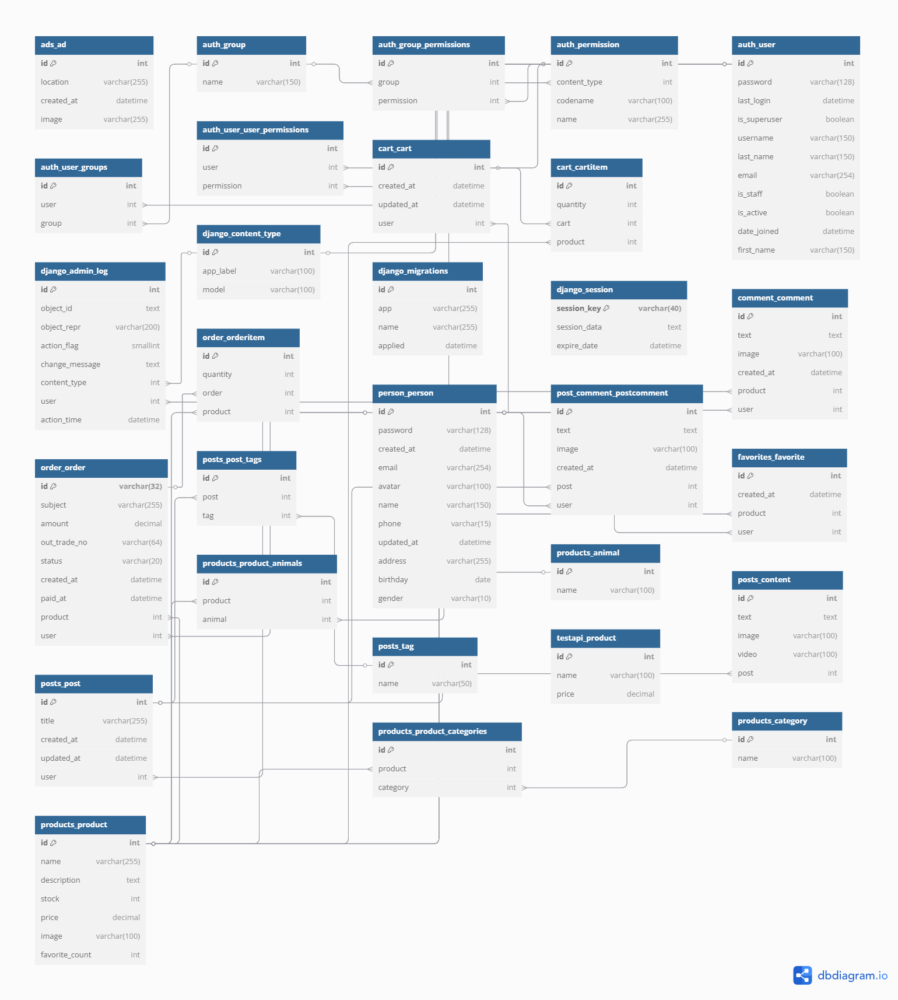

# 软件开发设计文档

## 1. 项目概述

### 1.1 项目背景
本项目为一个集电商与社区于一体的全栈平台，旨在为用户提供商品浏览、购物、支付、社区交流等一站式服务。后端采用 Django 框架，前端采用 Vue3 实现，支持多用户并发访问和数据安全。

### 1.2 项目目标

#### 计数范围边界
-	用户账户管理功能（注册、登录、个人信息修改）
-	商品浏览、收藏、点赞、购买及评论功能
-	社区互动功能（发帖与帖子评论）
- 支付功能（支付宝支付 API 调用）
-	商品分类检索功能
-	广告展示（轮播、推荐等）

#### 识别用户需求
-	浏览商品，便于选择心仪宠物及相关产品
-	收藏、点赞感兴趣的商品，方便后续查找
-	购买商品，实现便捷交易
-	评论商品，分享购物体验
-	参与社区互动，发帖和回复交流
-	利用支付宝完成安全支付
-	通过分类检索快速定位目标商品
-	账户注册登录及信息管理，保障个性化服务
-	能够根据广告获得推荐


### 1.3 项目范围
- PC 端 Web 应用
- 后端 API 服务
- 基础管理后台

---

## 2. 需求分析

### 2.1 功能需求

#### 用户模块
- 用户注册、登录、登出
- 用户信息查看与修改
- 用户密码修改与找回

#### 商品模块
- 商品列表、详情展示
- 商品分类、搜索
- 商品上下架管理（后台）

#### 购物车模块
- 添加、修改、删除购物车商品
- 购物车结算

#### 订单与支付模块
- 下单、支付（模拟/第三方接口）
- 订单查询、取消

#### 收藏与评论模块
- 商品收藏、取消收藏
- 商品评论、帖子评论

#### 社区模块
- 发帖、浏览、评论、点赞

#### 广告模块
- 首页轮播、广告位管理

### 2.2 非功能需求
- 数据安全，用户信息加密存储
- 良好的可扩展性和可维护性

---

## 3. 系统架构设计

### 3.1 总体架构

```
[前端 Vue3] <----REST API----> [后端 Django] <----> [数据库 SQLite3]
```

- 前端通过 Axios 调用后端 RESTful API
- 后端 Django 负责业务逻辑、数据存储、接口安全
- 数据库采用 SQLite3（可扩展为 MySQL/PostgreSQL）

### 3.2 技术选型说明
- 前端：Vue3 + Vue Router + Vuex + Element Plus
- 后端：Django + Django REST framework
- 数据库：SQLite3（开发环境），可迁移至 MySQL/PostgreSQL
- 其他：Nginx（生产环境静态资源与反向代理）

### 3.3 模块划分

- 用户管理（person）
- 商品管理（products）
- 购物车（cart）
- 订单与支付（order, pay）
- 广告管理（ads）
- 收藏夹（favorites）
- 评论系统（comment, post_comment）
- 社区帖子（posts）

---

## 4. 详细设计

### 4.1 主要模块设计

#### 4.1.1 用户模块
- 用户模型：用户名、邮箱、密码（加密）、头像、注册时间等
- 接口：注册、登录、登出、信息查询与修改

#### 4.1.2 商品模块
- 商品模型：名称、描述、价格、库存、分类、图片、上下架状态
- 接口：商品列表、详情、搜索、后台增删改查

#### 4.1.3 购物车模块
- 购物车模型：用户、商品、数量、添加时间
- 接口：添加、修改、删除、查询购物车

#### 4.1.4 订单与支付模块
- 订单模型：用户、商品、数量、总价、状态、创建时间
- 支付模型：订单、支付方式、支付状态、支付时间
- 接口：下单、支付、订单查询、取消订单

#### 4.1.5 社区与评论模块
- 帖子模型：用户、标题、内容、图片、创建时间、点赞数
- 评论模型：用户、内容、关联对象（商品/帖子）、时间
- 接口：发帖、评论、点赞、浏览

#### 4.1.6 广告模块
- 广告模型：图片、链接、展示位置、有效期
- 接口：广告列表、后台管理

### 4.2 数据库设计

#### 4.2.1 主要表结构（简要）

- 用户表（person_user）
- 商品表（products_product）
- 购物车表（cart_cart）
- 订单表（order_order）
- 支付表（pay_payment）
- 收藏夹表（favorites_favorite）
- 商品评论表（comment_comment）
- 帖子表（posts_post）
- 帖子评论表（post_comment_postcomment）
- 广告表（ads_advertisement）

> 详细字段见各 Django app 下的 `models.py`

#### 4.2.2 ER 图

### 4.3 接口设计

#### 4.3.1 示例：用户注册接口

- **URL**：`/api/person/register/`
- **方法**：POST
- **请求参数**：
  - username
  - email
  - password
- **响应**：
  - 成功：`{"code":0, "msg":"注册成功"}`
  - 失败：`{"code":1, "msg":"用户名已存在"}`

#### 4.3.2 其他接口
- 详见各 app 下 `views.py` 和 `serializers.py`
- 推荐使用 Swagger 或 DRF 自动生成接口文档

---

## 5. 安全设计

- 用户密码加密存储（Django 默认加密）
- 登录态采用 JWT 或 Session
- 重要接口需鉴权
- 支付接口防止重复提交
- 敏感信息（如密钥）不入库，存储于安全目录

---
# 以下均为假设部分

## 6. 部署与运维设计

### 6.1 部署架构

- 后端：Gunicorn/Uvicorn + Nginx
- 前端：Vue3 打包静态文件，Nginx 部署
- 数据库：生产环境建议使用 MySQL/PostgreSQL

### 6.2 环境依赖

- Python 3.x
- Node.js 16+
- pip、npm
- 数据库驱动

### 6.3 运维策略

- 日志记录（Django 日志、Nginx 日志）
- 定期备份数据库
- 监控服务状态

---

## 7. 测试设计

### 7.1 测试类型

- 单元测试（Django TestCase、前端 Jest）
- 接口测试（Postman、自动化脚本）
- 集成测试
- 用户验收测试

### 7.2 测试用例示例

- 用户注册、登录、登出
- 商品增删改查
- 购物车操作
- 下单与支付流程
- 社区发帖与评论

---

## 8. 其他设计

### 8.1 日志与监控

- 后端关键操作日志
- 异常捕获与报警

### 8.2 扩展性与可维护性

- 模块化设计，便于扩展新功能
- 代码注释与文档齐全

---

## 9. 参考文档

- [Django 官方文档](https://docs.djangoproject.com/zh-hans/5.1/)
- [Vue3 官方文档](https://cn.vuejs.org/)
- [Django REST framework](https://www.django-rest-framework.org/)